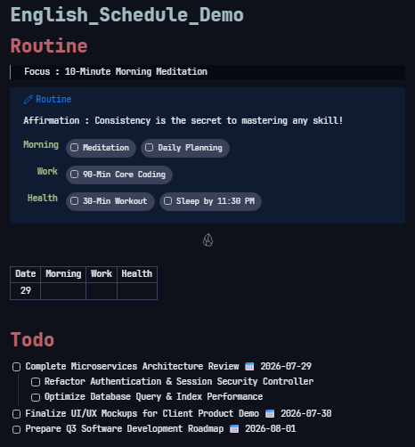
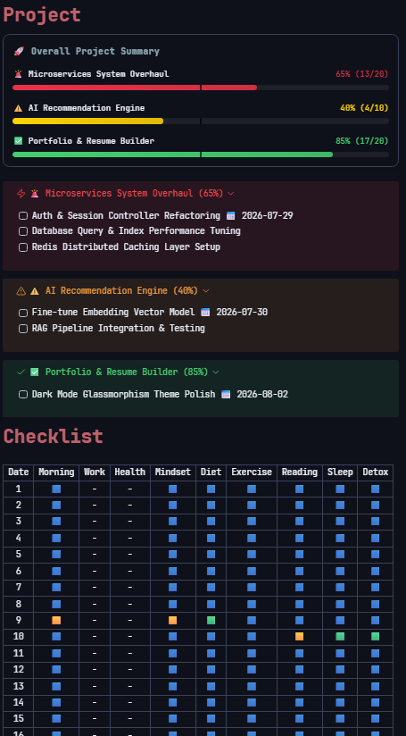
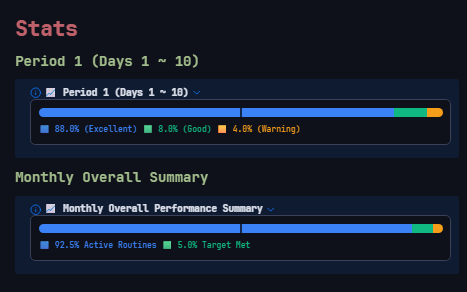

# Life OS Task Manager

> [!NOTE] 🚨 Major Release Notice (v1.1.2) 🚨
> **One-Stop ⚙️ GUI Modals & Seamless Action Widgets!**  
> Completely eliminates markdown formatting corruption caused by manual text editing.  
> **Supports both English and Korean natively.**  
> Easily manage your Daily Schedule, Routine Checklists, and Project Tasks through dedicated ⚙️ popup modals without manually editing raw markdown text!

---

## 📸 Showcase & Overview

*Sleek routine callout, instant header action widgets, and D-Day urgency-colored task lists.*

---

## ✨ Key Features

* **⚙️ One-Stop GUI Modals**: Edit Todo items, Routines, and Project Execution tasks via dedicated modal windows (`# Todo ⚙️`, `# Routine ⚙️`, `# Project ⚙️`).
* **🔄 Real-time Bi-directional Auto-Sync**: Tasks created or updated in your daily schedule or project modals automatically sync back to original project notes in real-time.
* **🎨 Clean D-Day Urgency Borders & Date Inheritance**: Clean border visualization (🔴 Today/Overdue, 🟡 D-1, 🟢 D-2, 🔵 D-3) without text badge clutter. Indented child tasks automatically inherit parent deadlines.
* **📝 Freely Editable `# Plan` Section**: Outline your project roadmaps and analysis freely under `# Plan`. Click the **`⬆️` (Copy to Execution) button** to promote planned tasks to top `# Execution` section instantly.
* **🌤️ One-Click Daily Reset & Monthly Archive**: Archives checked routine counts, resets checklists for tomorrow, and generates monthly performance report notes with a single click.

---

## 📊 Project Dashboard & Checklist Matrix

*Dynamic project progress tracking bar, callouts, and active-first routine checklist tables.*

---

## 📖 Complete User Guide

### 1. Daily Schedule Management (Control Tower)
* **Todo Manager (`# Todo ⚙️`)**: Click the ⚙️ icon to open popup modal. Edit task text freely, set deadlines (`📅 YYYY-MM-DD`), reorder tasks via `Alt + Up/Down`, and indent child tasks via `Tab / Shift+Tab`.
* **Routine Manager (`# Routine ⚙️`)**: Click the ⚙️ icon to add/delete/reorder routine categories and items safely across all archive notes.
* **Daily Reset (`☀️`) & Monthly Archive (`🗂️`)**: Archive today's progress and generate monthly performance report notes with one click.

---

### 2. Project Notes Workflow
* **Project Task Manager (`# Project ⚙️`)**: Click the ⚙️ icon next to `# Project` on your schedule note. View all active project execution tasks ordered by urgency level (🔥 > 🚨 > ⚠️ ...), edit tasks, and perform one-click batch save & bi-directional sync.
* **`# Plan` Section**: Freely write roadmap steps, technical analysis, and notes. Click the **`⬆️` (Copy to Execution) button** next to any uncompleted task to copy it up to the `# Execution` section for main schedule visibility.
* **`# Execution` Section**: Holds active tasks, synced bi-directionally in real-time with main schedule notes.

---

### 3. Routine Analytics & Performance Graphs

*Period-based achievement progress bars and monthly performance summaries.*

---

### 4. D-Day Urgency & Inheritance Rules
* **Border Visualization**: Clean border colors based on target deadline diff (🔴 Today/Overdue, 🟡 D-1, 🟢 D-2, 🔵 D-3, ⚪ Default).
* **Date Inheritance**: Indented child tasks automatically inherit target deadlines from their direct parent tasks for consistent urgency border colors.

---

## 🛠️ Customization & Signpost Rules (Do & Don't)

### ⛔ [Strictly Prohibited] Do not alter these signposts
Modifying these headers will break automatic parsing and synchronization:
1. **Major Section Headers**: `# Todo`, `# Routine` (`# 루틴`), `# Checklist` (`# 체크리스트`), `# Stats` (`# 통계`), `# Project` (`# 프로젝트`), `# Plan` (`# 계획`), `# Execution` (`# 실행`).
2. **Task Block IDs**: The 6-character identifier at the end of synced lines (e.g., `^a1b2c3`).

### ✅ [Freely Editable] Feel free to customize
1. **Routine & Task Lists**: Add, remove, rename, or reorder freely via dedicated ⚙️ GUI Modals.
2. **Project Plans**: Write detailed meeting notes, technical analysis, and roadmaps under `# Plan` or `# Details`.

---

## 🚨 Frequently Asked Questions (FAQ)

* **Q. Does this plugin support Korean?**
  * **A.** Yes! It natively supports both **English** and **Korean** based on your Obsidian language settings.
* **Q. Do routine updates propagate to past archive notes?**
  * **A.** Yes! Saving in the Routine Manager Modal automatically propagates column alignment and new categories across all weekly and monthly archive files under `4. Archive`.

---
*Created by KJH. For questions or support, please visit the developer feedback link in the plugin settings.*
