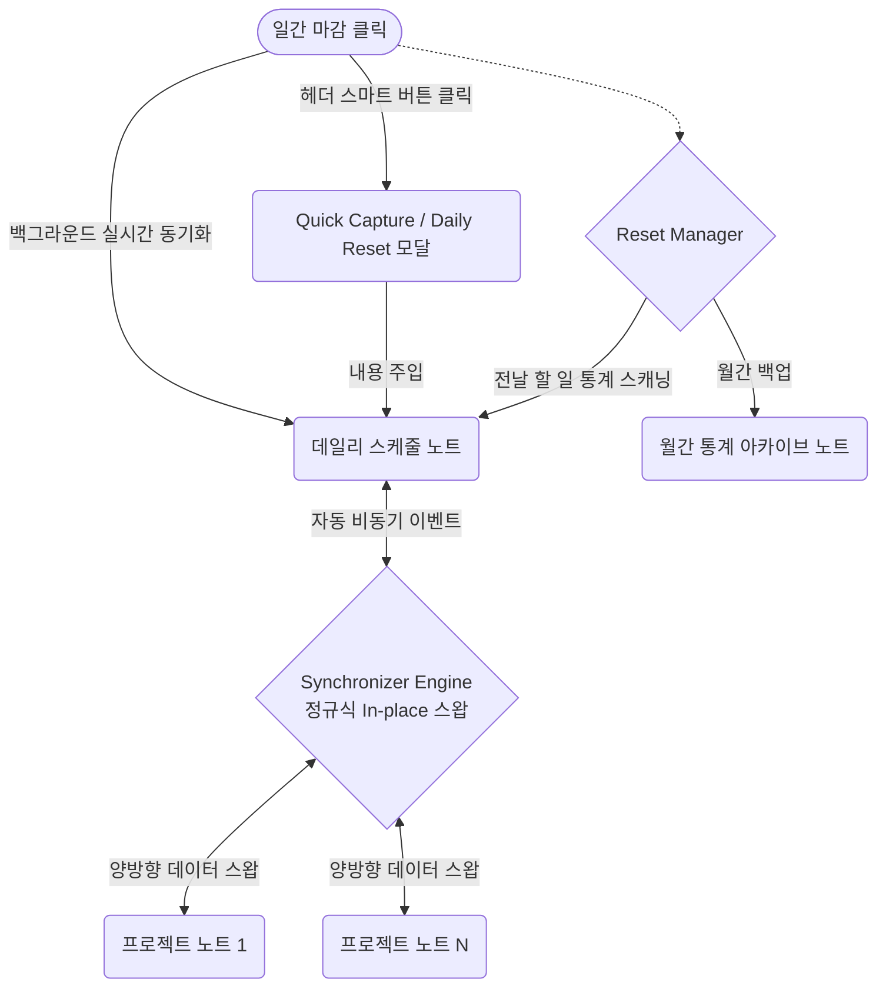

# MyWorld Task Manager

> **파편화된 할 일과 스케줄 관리를 중앙 집중화하고, 일일 루틴과 프로젝트를 완벽하게 연동하는 옵시디언 플러그인**  
> 이 플러그인은 템플레이터의 복잡한 스크립트와 지저분한 HTML 구문 대신, 단 한 번의 클릭으로 스마트한 지식 관리 체계와 마크다운 헤더 연동형 스마트 액션 버튼 환경을 구축합니다.

---

<br>

<p align="center">
  
  
  
  
</p>

<div align="center">
  
</div>
<br>
<div align="center">
  
  
</div>

---

> [!IMPORTANT]  
> **사용자의 지식 관리 시스템(PARA)과 결합하여 강력한 데일리 플래너와 스케줄링 환경을 제공합니다.**  
> - 문서 하단의 접힌 내용들을 열어보시면 플러그인의 핵심 아키텍처와 상세 기능들을 확인하실 수 있습니다.
> - **[자세한 설치 및 통합 사용 설명서 보러가기](./docs/8.%20플러그인_통합_사용_설명서.md)**

---
<details>
<summary><b>1. 기본 정보 (개발 환경 및 기술 스택) 📅</b></summary>
<br>

- 🖥️ **플랫폼:** Obsidian Desktop (Windows/Mac)
- 🛠️ **기술 스택 (Tech Stack):**
  - **Language:** `TypeScript`
  - **Environment:** `Node.js 18+`, `Obsidian API 1.5.0+`
  - **Bundler:** `esbuild`
  - **Styling:** `CSS3`

</details>

---
<details>
<summary><b>2. 프로젝트 전체 개요 (설계도 및 구조) 📊</b></summary>
<br>

**🎯 1. 프로젝트 목표**
> 본 프로젝트의 궁극적인 목표는 사용자가 옵시디언을 **제2의 두뇌(Second Brain)**로 구축하는 과정에서 겪는 시행착오를 최소화하는 것입니다.
>
> 1. **제2의 두뇌 원클릭 셋업**: **PARA 및 제텔카스텐(Zettelkasten)** 기반의 지식 관리 시스템에 처음 입문하는 사용자들을 위해, 복잡한 초기 폴더 구조 세팅과 템플릿 사용법을 **버튼 한 번 클릭(One-click)**으로 완벽하게 해결합니다.
> 2. **양방향 동기화 스케줄링**: 옵시디언 내에서 할 일(Task)들이 파편화되는 고질적인 문제를 해결하고자, 메인 스케줄 노트와 개별 프로젝트 노트들이 서로 완벽하게 **양방향 동기화(Bi-directional Sync)**되는 스케줄링 환경을 제공합니다.
>
> 기존 스케줄 관리 방식의 한계와 플러그인 도입 당위성은 👉 **[옵시디언 스케줄 시스템 분석 보고서](./docs/1.%20옵시디언_스케줄_시스템_분석_보고서.md)**를 참고해 주세요.

**💡 2. 기획 방향성 설계 (Core Strategy)**
- **결합형 지식 생태계**: 단순한 '할 일 관리'를 넘어, 장기적인 프로젝트(Project)와 일일 루틴(Daily Schedule)이 상호 작용하며 함께 성장하는 지식 생태계 구축
- **마찰력(Friction) 제로**: 복잡한 HTML 코드(`<div>`)나 external URI 플러그인 의존성을 배제하고, 마크다운 헤더(`# Todo`, `# 루틴`, `# 통계`, `# 실행`)에 직관적인 액션 버튼을 융합하여 마찰 없는 기록 환경 제공

**📊 3. 시스템 아키텍처 및 플러그인 설계 명세**
- **데이터 동기화 (Synchronizer)**: 옵시디언 File I/O 및 메타데이터 캐시 API를 활용하여, 백그라운드 자동 동기화로 스케줄 노트와 프로젝트 노트 간의 할 일 데이터 불일치를 감지하고 완벽하게 동기화합니다.
- **구조 생성기 (TemplateHelper)**: 정규표현식을 통해 일관된 순수 마크다운 서식을 유지하며, PARA 구조와 제텔카스텐 폴더 체계를 자동으로 생성합니다.
- **초기화 엔진 (ResetManager)**: 헤더 옆 일간 마감 버튼을 클릭하면 과거 데이터를 통계 노트로 아카이빙하고 새로운 스케줄 뷰를 렌더링합니다.
- 🔗 상세한 클래스 구조와 데이터 흐름도는 👉 **[플러그인 설계 및 구현 명세서](./docs/3.%20플러그인_설계_및_구현_명세서.md)**에서 확인하실 수 있습니다.



**💡 4. 사용자 메뉴얼 및 가이드**
- **초기 셋업**: 플러그인 설정 탭에서 `[PARA 구조 생성]` 및 `[스케줄 관리 노트 생성]` 버튼을 눌러 지식 관리 기반을 즉시 구축합니다.
- **일일 스케줄 관리**: `# Todo` 헤더 옆 `✏️` 버튼으로 빠른 할 일을 추가하고, 캘린더 모양의 위젯을 활용하여 마감일(D-Day)을 손쉽게 지정합니다.
- **프로젝트 빠른 실행**: 프로젝트 노트의 `# 실행` 헤더 옆 `✏️` 버튼을 눌러 프로젝트 전용 실행 할 일을 즉시 캡처합니다.
- 🔗 플러그인 수동 설치부터 각 기능별 상세한 활용 팁은 👉 **[플러그인 통합 사용 설명서](./docs/8.%20플러그인_통합_사용_설명서.md)**에 모두 정리되어 있습니다.

</details>

---
<details id="core-features">
<summary><b>3. 주요 기능 하이라이트 (Core Features) 🚀</b></summary>
<br>

**1) 지식 관리 시스템 자동 구축 (Setup Helper)**
- 버튼 한 번 클릭으로 **PARA (Project, Area, Resource, Archive)** 구조와 **제텔카스텐(Zettelkasten)** 폴더 구조를 자동 생성합니다.
- 순수 마크다운 양식 기반의 스케줄 템플릿과 프로젝트 계획서 템플릿(Template) 파일까지 완벽하게 세팅합니다.
<br>
<div align="center">
  
  
</div>

**2) 강력한 할 일 양방향 동기화 (Task Sync)**
- 메인 `스케줄 노트`와 각 `프로젝트 노트` 사이의 할 일 완료 상태(`[x]`)나 내용 수정이 **자동 백그라운드로 동기화**됩니다.
- 어디서 체크하든 원본 데이터가 안전하게 일치됩니다.
<br>


**3) 디데이(D-Day) 자동 계산 및 시각화**
- 할 일을 입력할 때 마감일(📅)을 지정하면, 디데이를 계산하여 시각적 마커(`[D]`, `[!]` 등)와 함께 예쁘게 시각화합니다.
- 마감일이 임박한 순서대로 스케줄 노트에 **자동으로 정렬**되어, 무엇이 급한지 즉시 파악할 수 있습니다.
<br>


**4) ✏️ 헤더 연동 빠른 할 일 등록 (Quick Capture)**
- `# Todo` 헤더 옆 `✏️` 버튼이나 `# 실행` 헤더 옆 `✏️` 버튼을 눌러 **빠른 할 일 모달창**을 엽니다.
- 달력(Date Picker)과 입력창을 통해 특정 날짜로 편하게 할 일을 주입할 수 있습니다.
<br>
<div align="center">
  
  
</div>

**5) 🌤️ 데일리 리셋 및 통계 아카이빙**
- `# 루틴` 헤더 옆 `🌤️` 일간 마감 버튼을 클릭하면, 전날의 스케줄 기록을 **월간 통계 노트**로 안전하게 백업합니다.
- 오늘 해야 할 루틴과 새로운 할 일 목록들로 깔끔하게 화면을 리셋합니다.
<br>
<div align="center">
  
  
</div>

> 🔗 **확장성 및 타 플러그인 연동**
> 향후 캘린더 등 타 플러그인과의 시너지 및 기능 확장에 대한 구상은 👉 **[플러그인 연동 및 보조 플러그인 기획](./docs/4.%20플러그인_연동_및_보조_플러그인_기획.md)**에 정리되어 있습니다.

</details>

---
<details id="technical-deepdive">
<summary><b>4. 기술적 깊이 - 핵심 로직 분석 및 트러블슈팅 사례 🛠️</b></summary>
<br>

본 프로젝트는 견고한 코드 컨벤션과 아키텍처 원칙(👉 **[옵시디언 플러그인 개발 정책](./docs/2.%20옵시디언_플러그인_개발_정책.md)**)을 바탕으로 구축되었습니다. 

### 🔍 핵심 로직 분석 (Core Logic Analysis)

**1️⃣ [Data Architecture] 마크다운 계층 보존을 위한 AST 파싱 엔진**
- **기능 구현:** 플랫(Flat)한 마크다운 텍스트 라인들을 단순 배열 정렬할 경우 하위 들여쓰기(Indent)가 파괴되는 문제를 막기 위해, 텍스트 스크림을 읽고 부모-자식 관계를 가지는 `TaskNode` 트리(Tree) 구조로 파싱하는 커스텀 AST 변환 로직을 설계했습니다.

```typescript
// TaskUtils.ts 中 (들여쓰기 뎁스를 기반으로 트리 구조 형성)
parseTasksToTree(lines: string[]): TaskNode[] {
    const nodes: TaskNode[] = [];
    const stack: { indent: number, children: TaskNode[] }[] = [{ indent: -1, children: nodes }];

    lines.forEach(line => {
        const indent = (line.match(REGEX.INDENT) || [""])[0].length;
        const node: TaskNode = { line, indent, children: [] };
        
        while (stack.length > 1 && stack[stack.length - 1].indent >= indent) stack.pop();
        stack[stack.length - 1].children.push(node);
        stack.push(node);
    });
    return nodes;
}
```

**2️⃣ [Sync Engine] 블록 ID 정규표현식을 활용한 In-place 동기화**
- **기능 구현:** 양방향 데이터 동기화 시 `replace`로 통째로 텍스트를 갈아끼우면 유저가 작성한 다른 데이터가 유실(Lost Update)될 수 있습니다. 이를 방지하고자 라인 후미에 달린 고유 블록 ID(`^1a2b3c`)만을 정규식으로 추출하여 해당 라인의 상태 괄호(`[x]`)만 핀포인트로 교체(Swap)하는 안전 장치를 구현했습니다.

```typescript
// Synchronizer.ts 中 (ID 매칭을 통한 상태 괄호 스왑 로직)
if (id && execMap.has(id)) {
    const updatedExecTask = execMap.get(id);
    const status = (updatedExecTask.line.match(REGEX.STATUS_MATCH))[1];
    // 원본 텍스트(pMatch[1] 등)는 보존하고 상태만 최신으로 교체
    newPlanLines.push(`${pMatch[1]} [${status}] ${text} ^${id}`);
}
```

**3️⃣ [UX & Lifecycle] 데일리 리셋 및 데일리 아카이빙 엔진**
- **기능 구현:** 사용자가 `# 루틴` 헤더 옆 `🌤️` 일간 마감 버튼을 클릭하면, 과거 스케줄을 스캐닝하여 루틴 완료 통계를 산출한 뒤 월간 아카이브 노트로 백업(Append)하고 데일리 노트를 초기화하는 LifeCycle 매니저를 구축했습니다.

```typescript
// ResetManager.ts 中 (통계 산출 후 월간 노트 백업)
async runDailyReset(dailyFile: TFile) {
    const content = await this.fileManager.getActiveViewOrFileText(dailyFile);
    const dailyMeta = this.utils.extractDailyMetadata(content);
    
    new DailyResetModal(this.app, this.settings.language, defaultReview, async (reviewInput, stepInput) => {
        // 백업 및 아카이빙 후 데일리 스케줄 리셋
    }).open();
}
```

</details>

---
<details id="troubleshooting">
<summary><b>5. 주요 트러블슈팅 및 버그 파해 사례 💡</b></summary>
<br>

- **사례 1: 라이브 프리뷰 포커스 튐 및 IME 조합 깨짐 방지**
  - CodeMirror6 에디터 위젯 부착 시 사용자가 타자 중인 활성 줄(`activeLines`)을 실시간 트래킹하여 위젯 생성을 일시 스킵함으로써 한글 조합 깨짐 및 커서 튀림을 100% 방지했습니다.
- **사례 2: 구형 HTML 상자 태그 제거 및 헤더 통합 액션 위젯 이식**
  - 마크다운 파일 상단에 존재하던 지저분한 HTML `<div>` 태그를 완전히 제거하고, 옵시디언 내장 SVG 벡터 아이콘과 CM6 Widget을 활용하여 마크다운 헤더와 결합된 깨끗한 스마트 툴바 환경을 완성했습니다.

</details>

---
*Created by KJH. For support, please check the feedback link in the plugin settings.*
