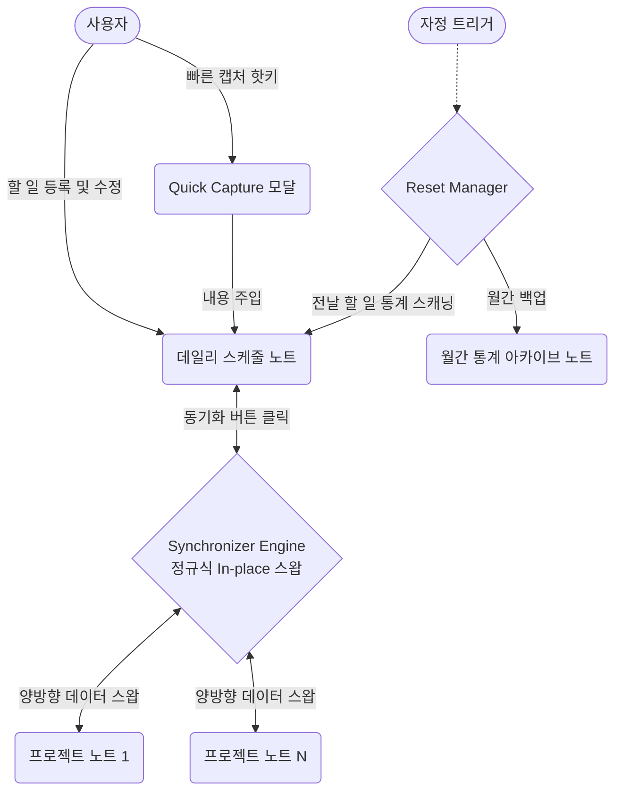
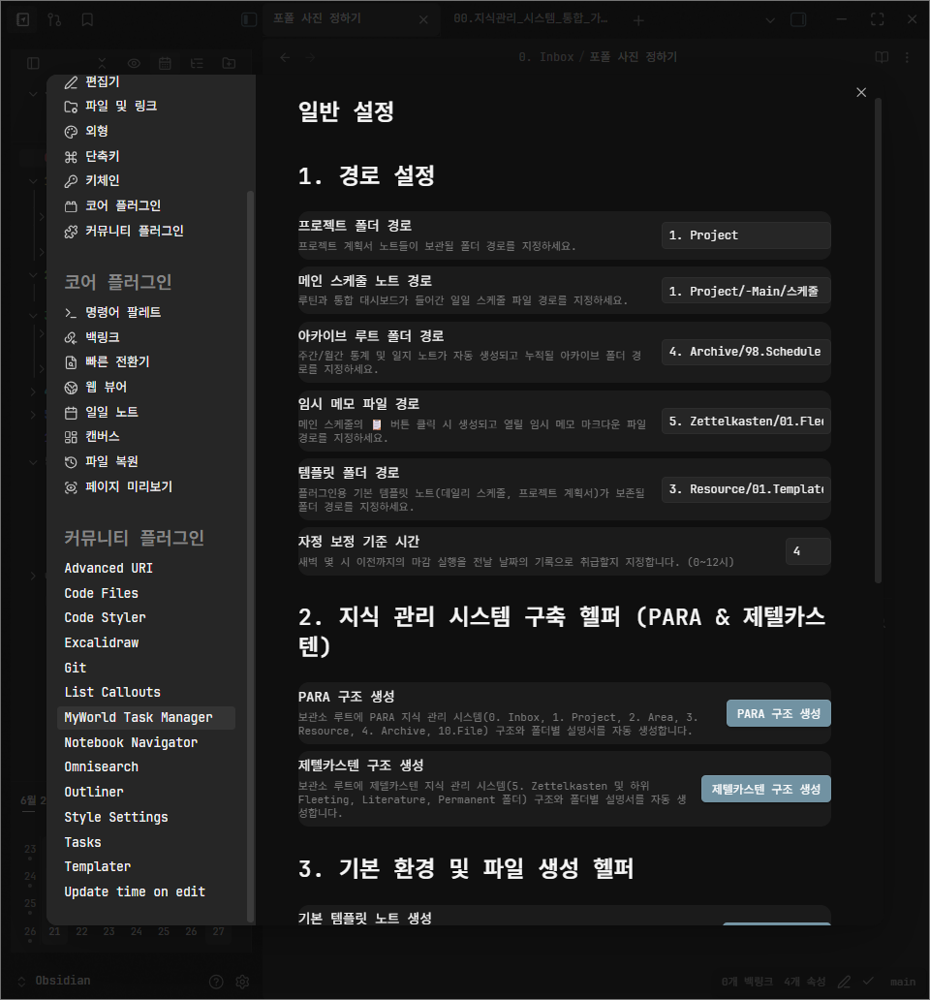

# MyWorld Task Manager

> **파편화된 할 일과 스케줄 관리를 중앙 집중화하고, 일일 루틴과 프로젝트를 완벽하게 연동하는 옵시디언 플러그인**  
> 이 플러그인은 템플레이터의 복잡한 스크립트 대신, 단 한 번의 클릭으로 스마트한 지식 관리 체계를 구축합니다.

---

<br>

<p align="center">
  
  
  
  
</p>

<div align="center">
  
</div>
<br>
<div align="center">
  
  
</div>

---

> [!IMPORTANT]  
> **사용자의 지식 관리 시스템(PARA)과 결합하여 강력한 데일리 플래너와 스케줄링 환경을 제공합니다.**  
> - 문서 하단의 접힌 내용들을 열어보시면 플러그인의 핵심 아키텍처와 상세 기능들을 확인하실 수 있습니다.
> - **[자세한 설치 및 통합 사용 설명서 보러가기](./docs/8.%20플러그인_통합_사용_설명서.md)**

---
<details>
<summary><b>1. 기본 정보 (개발 환경 및 기술 스택) 📅</b></summary>
<br>

- 🖥️ **플랫폼:** Obsidian Desktop (Windows/Mac)
- 🛠️ **기술 스택 (Tech Stack):**
  - **Language:** `TypeScript`
  - **Environment:** `Node.js 18+`, `Obsidian API 1.5.0+`
  - **Bundler:** `esbuild`
  - **Styling:** `CSS3`

</details>

---
<details>
<summary><b>2. 프로젝트 전체 개요 (설계도 및 구조) 📊</b></summary>
<br>

**🎯 1. 프로젝트 목표**
> 본 프로젝트의 궁극적인 목표는 사용자가 옵시디언을 **제2의 두뇌(Second Brain)**로 구축하는 과정에서 겪는 시행착오를 최소화하는 것입니다.
>
> 1. **제2의 두뇌 원클릭 셋업**: **PARA 및 제텔카스텐(Zettelkasten)** 기반의 지식 관리 시스템에 처음 입문하는 사용자들을 위해, 복잡한 초기 폴더 구조 세팅과 템플릿 사용법을 **버튼 한 번 클릭(One-click)**으로 완벽하게 해결합니다.
> 2. **양방향 동기화 스케줄링**: 옵시디언 내에서 할 일(Task)들이 파편화되는 고질적인 문제를 해결하고자, 메인 스케줄 노트와 개별 프로젝트 노트들이 서로 완벽하게 **양방향 동기화(Bi-directional Sync)**되는 스케줄링 환경을 제공합니다.
>
> 기존 스케줄 관리 방식의 한계와 플러그인 도입 당위성은 👉 **[옵시디언 스케줄 시스템 분석 보고서](./docs/1.%20옵시디언_스케줄_시스템_분석_보고서.md)**를 참고해 주세요.

**💡 2. 기획 방향성 설계 (Core Strategy)**
- **결합형 지식 생태계**: 단순한 '할 일 관리'를 넘어, 장기적인 프로젝트(Project)와 일일 루틴(Daily Schedule)이 상호 작용하며 함께 성장하는 지식 생태계 구축
- **마찰력(Friction) 제로**: 사용자가 설정과 스크립트 오류 해결에 시간을 낭비하지 않고, 즉시 본연의 '기록과 사고'에 집중할 수 있도록 완벽히 캡슐화된 자동화 기능 제공

**📊 3. 시스템 아키텍처 및 플러그인 설계 명세**
- **데이터 동기화 (Synchronizer)**: 옵시디언 File I/O 및 메타데이터 캐시 API를 활용하여, 스케줄 노트와 프로젝트 노트 간의 할 일 데이터 불일치를 감지하고 완벽하게 동기화합니다.
- **구조 생성기 (TemplateHelper)**: 정규표현식을 통해 일관된 서식을 유지하며, PARA 구조와 제텔카스텐 폴더 체계를 자동으로 생성합니다.
- **초기화 엔진 (ResetManager)**: 매일 자정을 기점으로 과거 데이터를 통계 노트로 아카이빙하고 새로운 스케줄 뷰를 렌더링합니다.
- 🔗 상세한 클래스 구조와 데이터 흐름도는 👉 **[플러그인 설계 및 구현 명세서](./docs/3.%20플러그인_설계_및_구현_명세서.md)**에서 확인하실 수 있습니다.



**💡 4. 사용자 메뉴얼 및 가이드**
- **초기 셋업**: 플러그인 설정 탭에서 `[PARA 구조 생성]` 및 `[스케줄 관리 노트 생성]` 버튼을 눌러 지식 관리 기반을 즉시 구축합니다.
- **일일 스케줄 관리**: 스케줄 노트에 할 일을 입력하고 캘린더 모양의 버튼을 활용하여 마감일(D-Day)을 손쉽게 지정합니다.
- **빠른 캡처**: 어느 노트에 있든 상단의 번개 모양 아이콘을 눌러 빠른 등록 모달창을 띄우고, 떠오른 할 일을 즉시 스케줄에 편입시킵니다.
- 🔗 플러그인 수동 설치부터 각 기능별 상세한 활용 팁은 👉 **[플러그인 통합 사용 설명서](./docs/8.%20플러그인_통합_사용_설명서.md)**에 모두 정리되어 있습니다.

</details>

---
<details id="core-features">
<summary><b>3. 주요 기능 하이라이트 (Core Features) 🚀</b></summary>
<br>

**1) 지식 관리 시스템 자동 구축 (Setup Helper)**
- 버튼 한 번 클릭으로 **PARA (Project, Area, Resource, Archive)** 구조와 **제텔카스텐(Zettelkasten)** 폴더 구조를 자동 생성합니다.
- 스케줄 동적 렌더링을 위한 스크립트와 프로젝트를 관리할 계획서 템플릿(Template) 파일까지 완벽하게 세팅합니다.
<br>
<div align="center">
  
  
</div>

**2) 강력한 할 일 양방향 동기화 (Task Sync)**
- 메인 `스케줄 노트`와 각 `프로젝트 노트` 사이의 할 일 완료 상태(`[x]`)나 내용 수정이 **양방향으로 동기화**됩니다. (⚡ 수시 동기화 버튼 클릭)
- 어디서 체크하든 원본 데이터가 안전하게 일치됩니다.
<br>


**3) 디데이(D-Day) 자동 계산 및 시각화**
- 할 일을 입력할 때 마감일을 지정하면, 디데이를 계산하여 커스텀 체크박스 마커(`[0]`, `[3]` 등)와 함께 **페이딩(Fading) 배경 하이라이트**로 예쁘게 시각화합니다. (기존의 복잡한 세로 컬러바 대신 심플하고 세련된 디자인으로 통일했습니다)
- 마감일이 임박한 순서대로 스케줄 노트에 **자동으로 정렬**되어, 무엇이 급한지 즉시 파악할 수 있습니다.
<br>


**4) ✏️ 빠른 할 일 등록 (Quick Capture)**
- 데일리 노트 어디서든 상단의 버튼을 눌러 **빠른 할 일 모달창**을 엽니다.
- 달력(Date Picker)과 입력창을 통해 내일 혹은 특정 날짜로 편하게 할 일을 주입할 수 있습니다.
<br>
<div align="center">
  
  
</div>

**5) 🔄 자정 데일리 리셋 및 통계 아카이빙**
- 매일 자정이 지나 새로운 날이 밝으면, 전날의 스케줄 기록을 **월간 통계 노트**로 자동으로 보내어 안전하게 백업합니다.
- 오늘 해야 할 루틴과 새로운 할 일 목록들로 깔끔하게 화면을 리셋합니다.
<br>
<div align="center">
  
  
</div>

> 🔗 **확장성 및 타 플러그인 연동**
> 향후 캘린더 등 타 플러그인과의 시너지 및 기능 확장에 대한 구상은 👉 **[플러그인 연동 및 보조 플러그인 기획](./docs/4.%20플러그인_연동_및_보조_플러그인_기획.md)**에 정리되어 있습니다.

</details>

---
<details id="technical-deepdive">
<summary><b>4. 기술적 깊이 - 핵심 로직 분석 및 트러블슈팅 사례 🛠️</b></summary>
<br>

본 프로젝트는 견고한 코드 컨벤션과 아키텍처 원칙(👉 **[옵시디언 플러그인 개발 정책](./docs/2.%20옵시디언_플러그인_개발_정책.md)**)을 바탕으로 구축되었습니다. 

### 🔍 핵심 로직 분석 (Core Logic Analysis)

**1️⃣ [Data Architecture] 마크다운 계층 보존을 위한 AST 파싱 엔진**
- **기능 구현:** 플랫(Flat)한 마크다운 텍스트 라인들을 단순 배열 정렬할 경우 하위 들여쓰기(Indent)가 파괴되는 문제를 막기 위해, 텍스트 스크림을 읽고 부모-자식 관계를 가지는 `TaskNode` 트리(Tree) 구조로 파싱하는 커스텀 AST 변환 로직을 설계했습니다.

```typescript
// TaskUtils.ts 中 (들여쓰기 뎁스를 기반으로 트리 구조 형성)
parseTasksToTree(lines: string[]): TaskNode[] {
    const nodes: TaskNode[] = [];
    const stack: { indent: number, children: TaskNode[] }[] = [{ indent: -1, children: nodes }];

    lines.forEach(line => {
        const indent = (line.match(REGEX.INDENT) || [""])[0].length;
        const node: TaskNode = { line, indent, children: [] };
        
        while (stack.length > 1 && stack[stack.length - 1].indent >= indent) stack.pop();
        stack[stack.length - 1].children.push(node);
        stack.push(node);
    });
    return nodes;
}
```

**2️⃣ [Sync Engine] 블록 ID 정규표현식을 활용한 In-place 동기화**
- **기능 구현:** 양방향 데이터 동기화 시 `replace`로 통째로 텍스트를 갈아끼우면 유저가 작성한 다른 데이터가 유실(Lost Update)될 수 있습니다. 이를 방지하고자 라인 후미에 달린 고유 블록 ID(`^1a2b3c`)만을 정규식으로 추출하여 해당 라인의 상태 괄호(`[x]`)만 핀포인트로 교체(Swap)하는 안전 장치를 구현했습니다.

```typescript
// Synchronizer.ts 中 (ID 매칭을 통한 상태 괄호 스왑 로직)
if (id && execMap.has(id)) {
    const updatedExecTask = execMap.get(id);
    const status = (updatedExecTask.line.match(REGEX.STATUS_MATCH))[1];
    // 원본 텍스트(pMatch[1] 등)는 보존하고 상태만 최신으로 교체
    newPlanLines.push(`${pMatch[1]} [${status}] ${text} ^${id}`);
}
```

**3️⃣ [UX & Lifecycle] 자정 리셋 및 데일리 아카이빙 엔진**
- **기능 구현:** 매일 밤 12시가 지났을 때 사용자가 첫 옵시디언 실행을 하면, 과거 스케줄을 스캐닝하여 완료/미완료 통계를 산출한 뒤 월간 아카이브 노트로 백업(Append)하고 데일리 노트를 초기화하는 LifeCycle 매니저를 구축했습니다.

```typescript
// ResetManager.ts 中 (통계 산출 후 월간 노트 백업)
async processReset(app: App, scheduleFile: TFile, previousDate: string) {
    const content = await app.vault.read(scheduleFile);
    const stats = this.calculateCompletionStats(content);
    
    const archiveContent = `## ${previousDate}\n- 완료: ${stats.done}\n- 미완료: ${stats.undone}\n\n`;
    await app.vault.append(archiveFile, archiveContent);
    await this.resetDailySchedule(app, scheduleFile); // 오늘 날짜 뷰로 초기화
}
```

> [!TIP]
> **더 방대하고 치열한 기술적 페인 포인트와 해결 과정(디버깅 기록)은 👉 [트러블슈팅(기술적 깊이) 보고서](./docs/6.%20트러블슈팅.md) 문서에서 확인하실 수 있습니다.**

**🔥 Troubleshooting: 문제 해결 및 설계적 방어 사례 (Key Highlights)**

1. **[Data Structure] AST 기반 정렬 알고리즘:** 들여쓰기로 이뤄진 마크다운 태스크의 계층이 정렬 시 파괴되는 문제를, 텍스트를 트리(Tree) 노드로 파싱하고 재귀적으로 정렬하는 엔진을 구현하여 원천 차단했습니다.
2. **[Optimization] 상태 하향 전파(Propagation) 스캐너:** 부모 태스크에만 상태/마감일을 부여해도, Indent 스코프를 추적하여 자식 태스크로 속성을 O(N) 속도로 하향 전파하는 논리적 스캐너를 구축했습니다.
3. **[Data Integrity] 정규식 기반 In-place 동기화:** 양방향 데이터 스왑 시 블록 캐시 ID(`^id`) 앵커만을 추출하여 핀포인트로 업데이트하는 안전성을 확보했습니다.
4. **[Defensive Programming] 마크다운 오염 방지 가드:** 캡처 대상 섹션을 찾지 못할 시 하드코딩으로 무분별하게 문서를 Append하는 대신, 즉시 런타임을 중단하고 사용자에게 피드백을 주어 노트 생태계를 보호했습니다.
5. **[CI/CD & Lint] 엄격한 정적 분석 파이프라인 돌파:** 글로벌 오픈소스 스토어 배포를 위해, `builtin-modules` 패키지 충돌을 제어하고 수십 개의 ESLint 타입 에러를 통제하여 CI/CD를 통과했습니다.
6. **[Deep Debugging] 원시 타입 속성 오염 추적:** `Cannot create property on string` 에러의 원인이 파라미터 매핑 누락으로 인한 String 객체화 실패임을 콜스택 단에서 추적하고, 인터페이스를 완벽히 교정했습니다.
7. **[Lifecycle Management] 핫 리로드(Hot Reload) 캐싱 충돌 제어:** 플러그인 빌드 갱신 시 메모리에 잔존한 구버전 인스턴스와 신규 모듈 간의 충돌 원인을 생명주기 관점에서 분석하고 클린 릴리즈 파이프라인을 구축했습니다.
8. **[DOM Manipulation] 타사 플러그인(Obsidian Tasks) 경고창 스팸 방어:** 순수 CSS만으로는 팝업 내용 필터링이 불가능하다는 한계를 인지하고, `MutationObserver`를 도입하여 특정 텍스트("obsidian-tasks-plugin warning")가 포함된 에러창만 실시간으로 은닉하는 핀포인트 예외 처리 로직을 구현했습니다.
9. **[CSS Optimization] 읽기 모드(Reading View) 렌더링 충돌 해결:** 마크다운 파서가 생성하는 HTML 리스트(DOM Tree) 구조를 분석하여, 불필요해진 자식 노드 검사 방어 코드(`:not(:has(...))`)를 폐기하고 직계 자식 결합자(`> .tag`)를 사용함으로써 부모-자식 간 배경색 증발 현상을 완벽히 해결했습니다.
10. **[Algorithm] 하위 작업 우선순위 상향 전파(Upward Propagation):** 부모 작업의 일정이 여유롭더라도 하위 자식 작업 중 단 하나라도 급박한 일정이 있다면, 재귀 순회를 통해 자식의 최고 우선순위를 부모에게 상향 전파하여 덩어리 전체를 스케줄 최상단으로 끌어올리는 지능형 정렬 시스템을 구현했습니다.
11. **[Type Safety] 전역 객체(Window) 확장을 통한 타입 캐스팅 제거:** 옵시디언 내장 모듈의 타입을 선언 병합(Declaration Merging)으로 Window 전역 인터페이스에 주입하여, 불안전한 `any` 우회 캐스팅 없이 100% 타입 안정성을 확보했습니다.

</details>

---
<details id="developer-guide">
<summary><b>5. 개발자 및 기여자 가이드 (Developer Guide) 💻</b></summary>
<br>

오픈소스 생태계에 기여(Contribute)하시거나 플러그인의 배포 파이프라인이 궁금하시다면 아래 공식 가이드를 참고해 주세요.

* **[플러그인 개발 및 공식 등록 가이드](./docs/5.%20플러그인_개발_및_공식_등록_가이드.md)**: 옵시디언 공식 커뮤니티 스토어에 플러그인을 등재하기 위한 PR(Pull Request) 절차 및 필수 요건을 다룹니다.
* **[플러그인 검증 및 배포 가이드](./docs/7.%20플러그인_검증_및_배포_가이드.md)**: 소스 코드를 빌드하고 새로운 버전을 릴리즈할 때 거쳐야 하는 내부 검증 프로세스와 버전 관리 규칙을 담고 있습니다.

</details>

---
<details id="retrospective-growth">
<summary><b>6. 회고 - 프로젝트 성찰 및 향후 기술적 지향점 📈</b></summary>
<br>

- **🟢 Keep (Continuous Learning): 텍스트 환경에서의 자료구조 활용과 알고리즘적 사고**
  - 단순히 프레임워크나 라이브러리의 기능(API)을 호출하는 데 그치지 않고, 마크다운이라는 순수 텍스트(Plain Text) 환경의 한계를 직접 구현한 **AST 트리 파싱**과 **정규식 In-place 스왑 알고리즘**을 통해 돌파해냈습니다. 
  - 이를 통해 프레임워크가 가려둔 저수준(Low-level)의 텍스트 처리와 자료구조 설계의 중요성을 깨달았으며, 앞으로도 문제의 본질을 파고드는 엔지니어링 방식을 유지하고자 합니다.

- **🟢 Keep (New Paradigm): Java(객체지향)에서 벗어나 TypeScript 및 플랫폼 특화 생태계 체화**
  - 기존에 익숙했던 Java의 엄격한 클래스 기반 객체지향(OOP) 설계에서 나아가, **TypeScript의 구조적 타이핑(Structural Typing)**과 **유니온 타입(Union Types)**을 학습하며 더욱 유연하고 안전한 타입 시스템을 체화했습니다.
  - 특히 단순한 로컬 앱이 아닌 플랫폼 플러그인을 개발하며, `app.vault`를 활용한 비동기 파일 I/O 및 데이터 제어, `MutationObserver`를 활용한 DOM 실시간 추적 및 조작, `app.workspace`와 연동되는 이벤트 주도(Event-driven) 아키텍처 등 **기본 Java 문법만으로는 경험하기 힘든 웹/옵시디언 생태계 특화 기능과 비동기 제어 패러다임**을 새롭게 공부하고 성공적으로 프로젝트에 녹여냈습니다.

- **🔴 Problem (Defensive Awareness): 예외 상황(Edge Case) 및 런타임 환경에 대한 고려 미흡**
  - 프로젝트 초기에는 '정상적인 동작(Happy Path)'에만 치중하여, 유저가 마크다운 템플릿을 임의로 지우거나 플러그인 핫 리로드 시 이전 메모리 캐시가 남아있는 등의 런타임 엣지 케이스들을 제대로 제어하지 못했습니다.
  - 이로 인해 소중한 유저의 노트 데이터가 오염되거나 `TypeError`가 터지는 등 오픈소스가 가져야 할 가장 중요한 덕목인 '안정성' 측면에서 뼈아픈 시행착오를 겪었습니다.

- **🔵 Try (Defensive & Automated Planning): 방어적 프로그래밍 및 CI/CD의 체화**
  - **[코드 레벨]** 단순히 콘솔에 에러 로그만 띄우는 것을 넘어, 예외 발생 시 쓰기 연산을 즉각 차단(Return)하여 **유저 데이터를 최우선으로 보호하는 방어적 프로그래밍 원칙**을 정립했습니다.
  - **[인프라 레벨]** 옵시디언 봇의 엄격한 검수와 캐싱 충돌을 겪은 후, 앞으로 어떤 프로젝트를 하더라도 코드 작성 초기부터 **정적 분석기(Linter)와 배포 자동화 파이프라인(CI/CD)**을 세팅하여 휴먼 에러를 시스템적으로 차단하는 습관을 들이기로 다짐했습니다.

</details>

---

### 📝 License & Contact
- **License**: MIT License - 누구나 자유롭게 활용하고 기여할 수 있는 오픈소스 프로젝트입니다.
- **Contact**: GitHub Issue 탭을 통한 버그 제보 및 PR을 환영합니다.
- **Developer**: [GitHub Profile](https://github.com/kim50504376) | 📧 kim50504376@gmail.com
